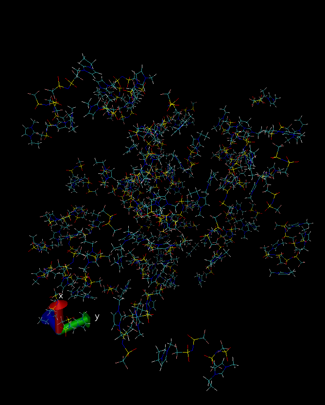

# Ionic Liquids

> vizualization created using [VMD](www.ks.uiuc.edu/Research/vmd/
)

This example builds a box with species of an ionic liquid:

## *emim.mol* file:

Contains molecular information about the cation "ethyl-methyl-imidazolium" (emim+)

## *ntf2.mol* file:

Contains molecular information about the anion "bis(trifluoromethylsulfonyl)imide" (NTf2-)

## *ntf2.mol* file:

Contains force field information for both emim and ntf2 species

## *box.mol* file:

Contains box specification with the ionic liquid pair

## to try it, run:

	playmol box.mol

## info files
  README.md
  il.png

## input files:
  ntf2.mol
  emim.mol
  box.mol
  forcefield.mol

## output files:
  playmol.log
  emim_ntf2.xyz
  emim_ntf2.lmp
  emim_ntf2.lammpstrj

