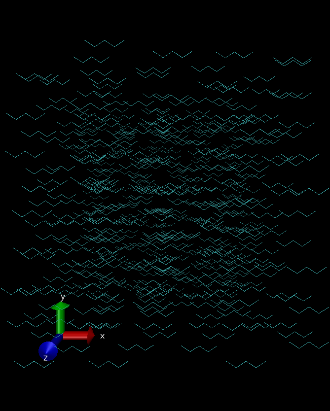

# Linear Hydrocarbons

> vizualization created using [VMD](www.ks.uiuc.edu/Research/vmd/
)

This example builds a box with molecules of an linear hydrocarbon component:

## *linear-hydrocarbons.mol* file:

Contains molecular information and box specification

## *nerd.mol* file:

Contains force field parameters for the atoms present in *linear-hydrocarbons.mol*

## to try it, run:

	playmol linear-hydrocarbons.mol

## info files
  README.md
  c5.png

## input files:
  linear-hydrocarbons.mol
  nerd.mol

## output files:
  playmol.log
  C5_nerd.xyz
  C5_nerd.lmp
  C5_nerd.lammpstrj
