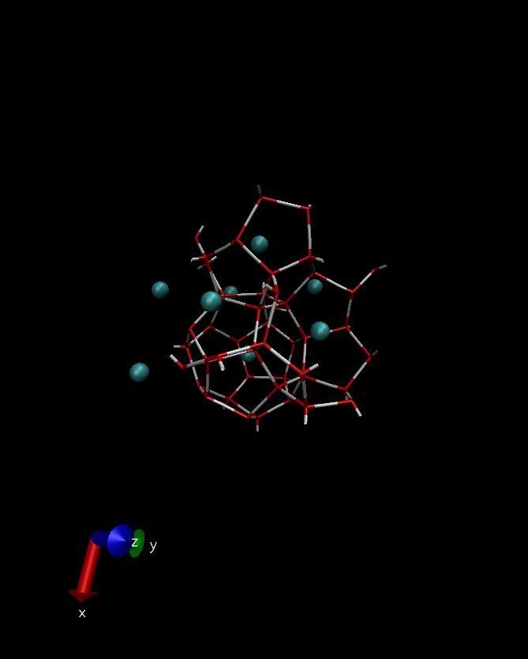

# Methane Hydrate

> vizualization created using [VMD](www.ks.uiuc.edu/Research/vmd/
)

This example builds a box with molecules of water and methane in CS1 hydrate structure:

## *unit-cell.mol* file:

Contains molecular information and box specification

## *TIP4P-ice.mol* file:

Contains force field parameters for the atoms present in *unit-cell.mol*

*uc-water.mol* and *uc-methane.mol* files:

Contains atomic coordinates for water molecules (atomistic) and for methane molecules (center of mass), respectively

## to try it, run:

	playmol unit-cell.mol

## info files
  README.md
  CS1.png

## input files:
  unit-cell.mol
  TIP4P-ice.mol
  uc-methane.mol
  uc-water.mol

## output files:
  playmol.log
  water_TIP4P-ice.xyz
  water_TIP4P-ice.lmp
  water_TIP4P-ice.lammpstrj

## references
>* http://lammps.sandia.gov/doc/Section_howto.html#howto-8
>* http://lammps.sandia.gov/doc/pair_lj.html
>* J Chem Phys. 2013 Mar 28;138(12):124504. doi: 10.1063/1.4795499 (http://aip.scitation.org/doi/10.1063/1.4795499)
>* The Journal of Chemical Physics > Volume 133, Issue 6 > 10.1063/1.3466751 (http://aip.scitation.org/doi/10.1063/1.3466751)

