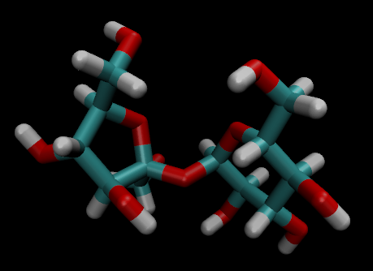

# Sucrose Example

----------------------------------------------------------------------------------------------------

> Visualization created using [VMD](www.ks.uiuc.edu/Research/vmd/)

----------------------------------------------------------------------------------------------------
Description
----------------------------------------------------------------------------------------------------

This example uses Playmol and LAMMPS to simulate a single sucrose molecule solvated in water. The
solute is modeled as two rigid bodies connected by two consecutive chemical bonds to an oxygen atom.

**NOTE**: this example uses the Playmol capabilities of dealing with rigid bodies and requires
some new commands to be present in LAMMPS:

    neigh_modify exclude custom/match property group-ID
    fix ID group-ID rigid/npt/small custom property keywords

----------------------------------------------------------------------------------------------------
Requirements
----------------------------------------------------------------------------------------------------

1. [AMBER Tools](http://ambermd.org/#AmberTools) installed
2. Environmental variable AMBERHOME containing the path to AMBER Tools' directory
3. [LAMMPS](https://github.com/lammps/lammps) installed and compiled
4. Environmental variable LAMMPSHOME containing the path to the LAMMPS executable `lmp_mpi`

----------------------------------------------------------------------------------------------------
Preparation Steps (Done!)
----------------------------------------------------------------------------------------------------

Create file `GLYCAM_06j.playmol` from AMBER's `GLYCAM_06j.dat` using playmoltools:

    playmoltools -f amber -i $AMBERHOME/dat/leap/parm/GLYCAM_06j.dat -o GLYCAM_06j.playmol

Create file `sucrose.pdb` using Glycam-Web's [Carbohydrate Builder](http://glycam.org/cb). For this,
use the condensed code `DFrufb2-1DGlcpa` to generate a PDB file, download it, and execute:

    mv 1.pdb sucrose.pdb

Create file `sucrose.playmol` from `sucrose.pdb` using playmoltools and GLYCAM's prep file:

    playmoltools -f pdb -p $AMBERHOME/dat/leap/prep/GLYCAM_06j-1.prep -i sucrose.pdb -o sucrose.playmol

----------------------------------------------------------------------------------------------------
Execution Step
----------------------------------------------------------------------------------------------------

Run Playmol to create a system containing one sucrose molecule solvated in water:

    playmol sucrose_in_water.playmol

Execute LAMMPS to simulate the system:

    mpirun -n 4 $LAMMPSHOME/lmp_mpi -in in.sucrose_in_water
