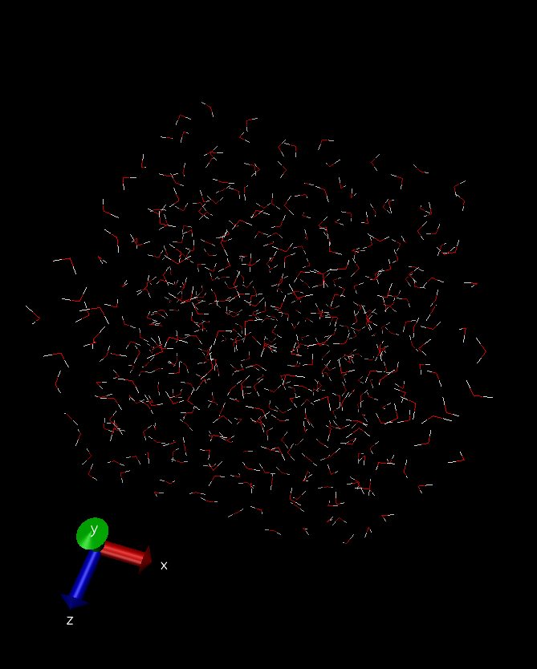

# Water

> vizualization created using [VMD](www.ks.uiuc.edu/Research/vmd/
)

This example builds a box with molecules of water:

## *water.mol* file:

Contains molecular information and box specification

## *TIP3P.mol* file:

Contains force field parameters for the atoms present in *water.mol*

## to try it, run:

	playmol water.mol

## info files
  README.md
  water.png

## input files:
  water.mol
  TIP3P.mol

## output files:
  playmol.log
  water_TIP3P.xyz
  water_TIP3P.lmp
  water_TIP3P.lammpstrj

